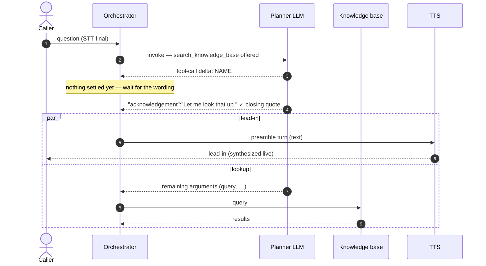

# Worked PR body

A filled-in example of the skeleton in `SKILL.md` §5, for a two-commit latency
fix. Copy the shape, not the words. Everything below the line is the body.

---

## What

On a RAG turn the caller asks a question and then waits in silence. The lead-in
could not be spoken until the *complete* tool call had streamed, so the caller
waited out every argument the model wrote, then a full TTS time-to-first-audio
(0.6–0.9s on ElevenLabs in prod traces), before hearing anything.

Measured on call `62a2ed75-474b-46e1-b969-5a278ff5e2cb`: **1.20s of dead time**
between the LLM finishing its stream at 14.28s and text reaching TTS at 15.49s
— 64% of that turn's latency.

## Why

`search_knowledge_base` now takes an `acknowledgement` argument, named to sort
ahead of the others: `jsonschema.Definition` holds `Properties` in a Go map, so
`encoding/json` serializes them alphabetically, and that is the order the model
generates in. `firstCompleteStringField` (`pkg/llm/stream.go:212`) reads that
one string field out of a JSON object still being written and reports a value
only once its closing quote arrives — half a sentence must never be spoken.

## How

1. **refactor** — extract `firstCompleteStringField` out of `WordifyTokens`,
   shared with the planner path instead of duplicated. No behaviour change.
2. **fix** — publish the lead-in the instant its argument closes, plus the
   regression test.

### Timeline of a RAG turn

The lead-in and the lookup run in parallel — the lead-in goes out as soon as its
argument closes, while the query is still being written.

## Testing

- `TestKBPreamble_SpeaksAsSoonAsTheArgumentCloses` verified **RED** on
  `origin/main` (`expected first audio ≤0.3s / actual 1.24s`), green here.
- `go test ./pkg/llm/ ./pkg/models/turn_schema/` green; `-race -count=2` on
  `TestKBPreamble` green.
- `go build ./...`, `go vet ./pkg/llm/`, `gofmt` clean on the files touched.
- `make lint`: **0 issues**.
- `make test-unit` green except `pkg/incallmessaging` (needs docker) — the same
  pre-existing failure #2030 recorded on `origin/main`.

## Out of scope

The preamble is 1.68–1.72s of audio while the work behind it is ~1.1s, so the
answer's first audio is sometimes ready before the lead-in finishes. Shortening
it is a schema question, separate from this.

Refs: [ENG-6686](https://linear.app/synthflow/issue/ENG-6686)
